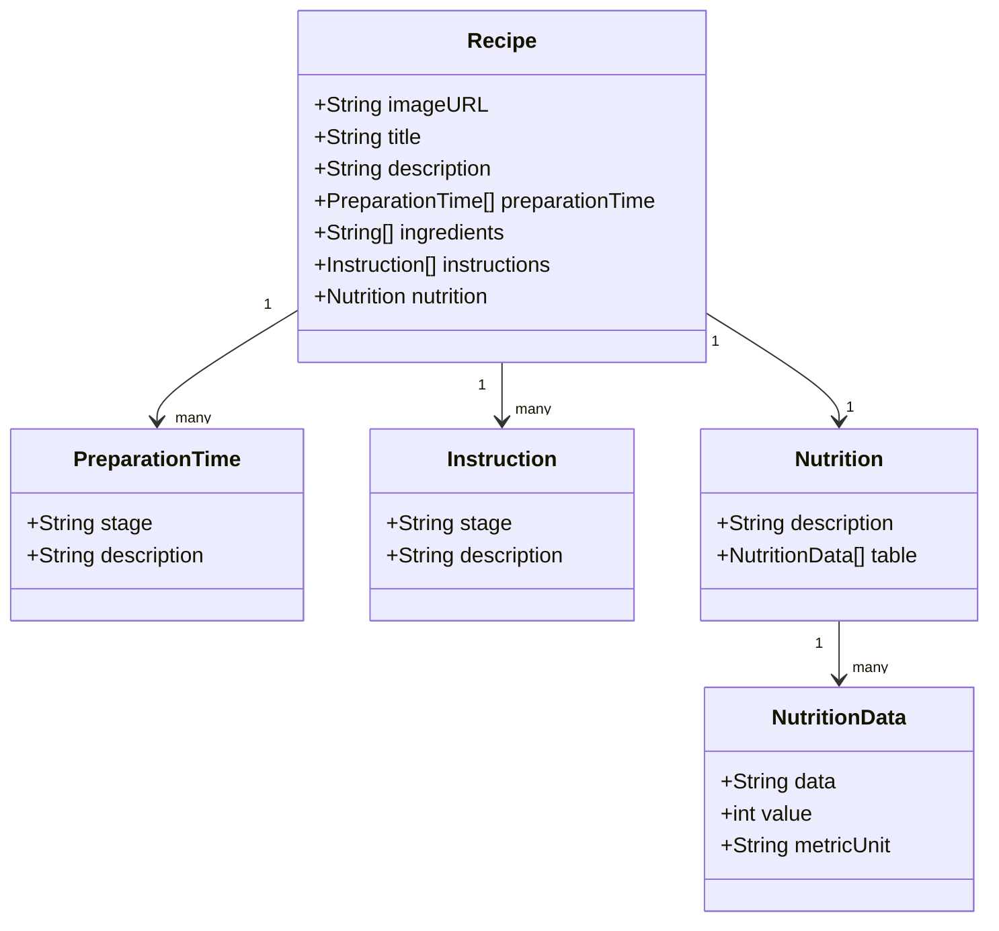

# API de Receitas
Desenvolvendo uma API para um antigo projeto front-end, um site totalmente responsivo que exibe receitas.

## Modelagem de Classes (Mermaid)

```mermaid
classDiagram
    class Recipe {
      +String imageURL
      +String title
      +String description
      +PreparationTime[] preparationTime
      +String[] ingredients
      +Instruction[] instructions
      +Nutrition nutrition
    }

    class PreparationTime {
      +String stage
      +String description
    }

    class Instruction {
      +String stage
      +String description
    }

    class Nutrition {
      +String description
      +NutritionData[] table
    }

    class NutritionData {
      +String data
      +int value
      +String metricUnit
    }

    Recipe "1" --> "many" PreparationTime
    Recipe "1" --> "many" Instruction
    Recipe "1" --> "1" Nutrition
    Nutrition "1" --> "many" NutritionData
```
